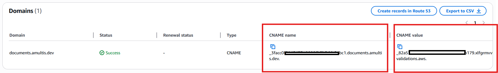
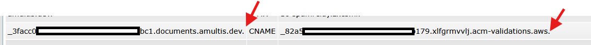
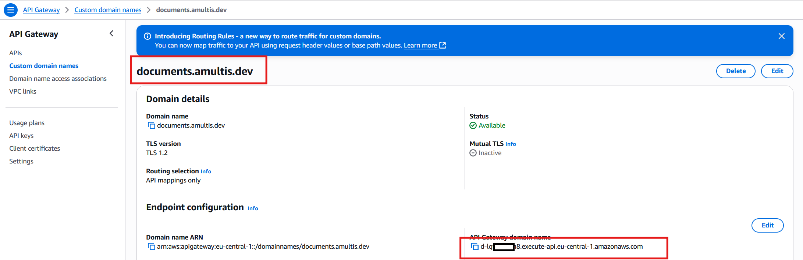
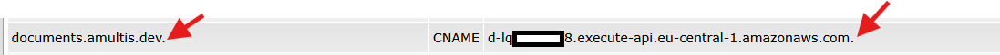

# CustomDomain creation
CustomDomain is used to create a verified custom domain name for API gateway.
It uses several independent submodules and Cloudformation templates.
<BR>
__Steps for the CustomDomain template__:
 
## 1) Create basic structure in root folder (so one folder up)
AWS CloudFormation Stack files for the solution
```
cd ..
```

```
git submodule add https://github.com/Pierre-AmultisDev/aws_cfn_s3_via_apigw stack_templates
```

Scripts to create and manage the CloudFormation stack
```
git submodule add https://github.com/Pierre-AmultisDev/aws_cfn_stack_scripts stack_scripts
```

Scripts to test the CloudFormation stack
```
git submodule add https://github.com/Pierre-AmultisDev/aws_cfn_test_scripts stack_tests
```

## 2) Set files for this project in root folder
```
_AWS-region.txt      AWS region where to create stack
_AWS-profile.txt     AWS profile name used to create stack 
_AWS_costcenter.txt  costcenter tag to use when stack is created 
```

## 3) Update stack_template file
Replace parametervalues in CustomDomainv*-boiler.json 
```
APICustomDomainName    :  The name of the custom domain to use
APIValidationDomainName:  The of the domain to validate. Most of the time the same as APICustomDomainName

```

## 4) Create the CustomDomain stack using the Cloudformation script
Update the content of _current_version with the this template (for example CustomDomainv001)

## 5) Validate custom domain
This CloudFormation template generates a ACM certificate but the linked domainname needs to be validated.
[You can find the certificates here:](https://eu-central-1.console.aws.amazon.com/acm/home?region=eu-central-1#/certificates/list)

Add the info from to domain DNS server. Don't forget the . at both ends

It might take some time before the (sub)domain is present in DNS and before ACM validates it.
<BR>
You can check if the CNAME for validation is created with tools like [mxtoolbox - SuperTool - cname](https://mxtoolbox.com/SuperTool.aspxYou)

## 6) Link custom domain name to API GW
When the certificate is verified, the domain name can be linked to API Gateway domein name. <BR>
__IMPORTANT__Don't use the API Gateway direct link for this! 
[You can find that info here:](https://eu-central-1.console.aws.amazon.com/apigateway/main/publish/domain-names?region=eu-central-1)

Add the info from to domain DNS server. Don't forget the . at both ends


## 7) Do some preliminary testing
You can check if the custom domain name links to the via CNAME to API Gateway domain name with tools like [mxtoolbox - SuperTool - cname](https://mxtoolbox.com/SuperTool.aspxYou)
